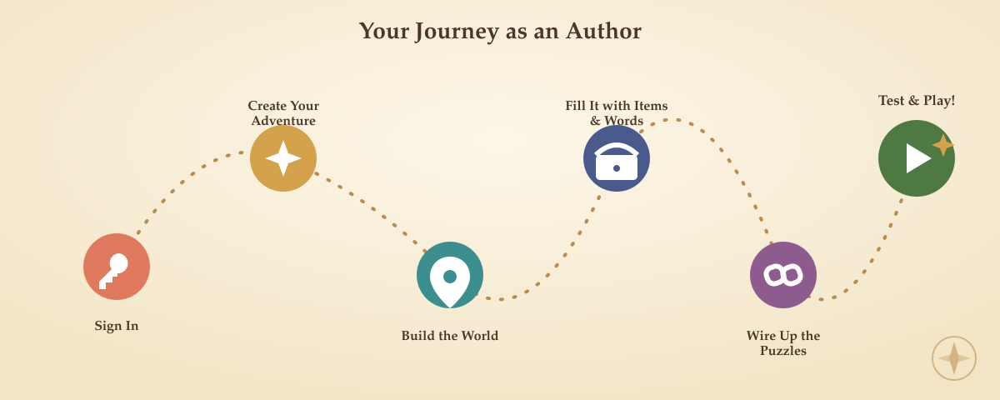

# Adventure Builder — Author Handbook

This handbook is for **Authors** — the people who design, build, and test text
adventures in Adventure Builder. It walks through every screen you can reach
from the web app, in the order you'll actually meet them: signing in,
creating an adventure, building its world, and finally playing it back.

It documents the app **as it exists today**, verified against the current
source code (not the design intent) — including a couple of places where a
screen is still a work in progress. Where something isn't finished yet, this
handbook says so plainly rather than describing an aspirational version.

> Looking for the engineering-facing specification instead (data model,
> mappers, security wiring, the rebuild blueprint)? See
> [`../specs/00-index.md`](../specs/00-index.md). This handbook is the
> user-facing companion to that document — same product, different audience.

## Who this is for

Anyone signed in with the **Author** role. If you're an **Admin**, everything
here applies to you too — Admins inherit every Author capability. If you're a
**Player**, see the note in [Chapter 11](author/11-testing-and-running.md) —
most of this handbook is about *building* adventures, but the play screen
itself is one you'll share with players.

## Table of contents

| # | Chapter | What's in it |
|---|---------|---------------|
| 1 | [Welcome & the big picture](author/01-welcome.md) | What Adventure Builder is, the three roles, and the vocabulary you'll see throughout the app |
| 2 | [Signing in](author/02-signing-in.md) | The login screen, what happens after you sign in, and signing out |
| 3 | [Your Adventures](author/03-your-adventures.md) | The adventure list: creating, opening, deleting, and running your adventures |
| 4 | [The Adventure Editor](author/04-the-adventure-editor.md) | Your adventure's mission control — title, notes, and the five "Manage" hubs |
| 5 | [Locations & Exits](author/05-locations-and-exits.md) | Building the rooms of your world and the exits that connect them |
| 6 | [Items](author/06-items.md) | Things players can see, carry, and wear |
| 7 | [Vocabulary & Words](author/07-vocabulary-and-words.md) | Teaching your adventure the words it understands |
| 8 | [Commands, Actions & Conditions](author/08-commands-actions-and-conditions.md) | The heart of gameplay: what happens when a player types something |
| 9 | [Workflow: commands that run everywhere](author/09-workflow.md) | Global rules that apply no matter where the player is |
| 10 | [Messages](author/10-messages.md) | Reusable text snippets your commands can print |
| 11 | [Testing & Running your adventure](author/11-testing-and-running.md) | Playing your adventure from inside the editor, or from your adventure list |
| 12 | [Tips, gotchas & current limits](author/12-tips-and-current-limits.md) | Honest notes on what's still rough around the edges |
| A | [Appendix: Action & Condition reference](author/appendix-a-action-and-condition-reference.md) | Every Action and PreCondition type, in one table |

## How to read this

- **Bold** text names something you'll click or type exactly as written —
  a button label, a field name, a menu entry.
- Blockquoted notes like the one below call out a gotcha, a current
  limitation, or a detail that trips authors up:

  > **Note:** This is what a callout looks like. Read these — they usually
  > save you a confused ten minutes.

- Diagrams that show *how a process works mechanically* (a flowchart of what
  the engine checks, in what order) live under
  [`images/diagrams/`](images/diagrams/) and are kept plain and precise on
  purpose. Diagrams that show *the shape of your journey through the app*
  live under [`images/playful/`](images/playful/) and are allowed to have
  more fun with it.

Start at [Chapter 1](author/01-welcome.md) if you're new, or jump straight to
the chapter for the screen you're stuck on.
