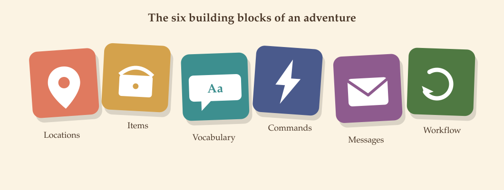

# 1. Welcome & the big picture

Adventure Builder is a web app for writing and playing text adventures —
the kind of game where you type `take key` or `go north` and read what
happens next. As an **Author**, you design the game: you build the rooms,
place the objects, teach the game the words it should understand, and wire
up what happens when a player tries something.

## The three roles

Every account has one or more of three roles, and each role includes
everything below it:

```
Admin  ⊃  Author  ⊃  Player
```

| Role | What they do |
|------|---------------|
| **Admin** | Manages user accounts and decides which Author owns which adventure, and which Players may play it. Can do everything an Author or Player can. |
| **Author** | Designs adventures: locations, items, vocabulary, commands, messages, and the workflow that ties it together. Can also play — their own and anyone else's they're assigned to. |
| **Player** | Plays the adventures they've been assigned to, from a personal library. |

You don't assign yourself an adventure to author — an **Admin** does that.
If you've just signed in and your adventure list is empty, that's the first
thing to check with whoever administers your Adventure Builder instance.

## The words you'll see everywhere

A handful of terms recur across almost every screen. It's worth knowing
them up front — the rest of this handbook uses them without re-explaining
each time.

| Term | Plain-language meaning |
|------|------------------------|
| **Adventure** | The whole game: its title, notes, locations, items, vocabulary, and messages, all in one place. |
| **Location** | A room or place in your world. Players stand in exactly one location at a time. |
| **Exit** (called *Direction* in a few older places) | A way to move from one location to another — `north`, `enter cave`, whatever verb you assign it. |
| **Item** | An object in the world — something a player can look at, and often pick up, drop, or wear. |
| **Vocabulary** | The dictionary of words your adventure understands: nouns, adjectives, and verbs. If a word isn't in your vocabulary, players can't use it. |
| **Command** | A rule: *when the player types this verb (+ optional adjective/noun), and these conditions are true, do these things.* This is where puzzles and interactions live. |
| **Action** | One thing a command does — show a message, move the player, take an item, change a variable, and so on. |
| **PreCondition** | A yes/no check a command runs before it fires — "is the player carrying the key?" |
| **Message** | A reusable piece of text, referenced by an id, that a command can print. |
| **Workflow** | Commands that run every turn, everywhere — not tied to one location. |

If a term shows up in this handbook that isn't in this table, it'll be
explained where it's first used.



These six pieces — Locations, Items, Vocabulary, Commands, Messages, and
Workflow — are the building blocks of every adventure. Chapters 5 through 9
cover them one at a time, in the order you'll typically build them.

## What's next

[Chapter 2](02-signing-in.md) covers signing in and where you land. If
you're already signed in and just want the fastest path to a working
adventure, jump to [Chapter 3](03-your-adventures.md) — **Create Adventure**
is the first button you'll press.
