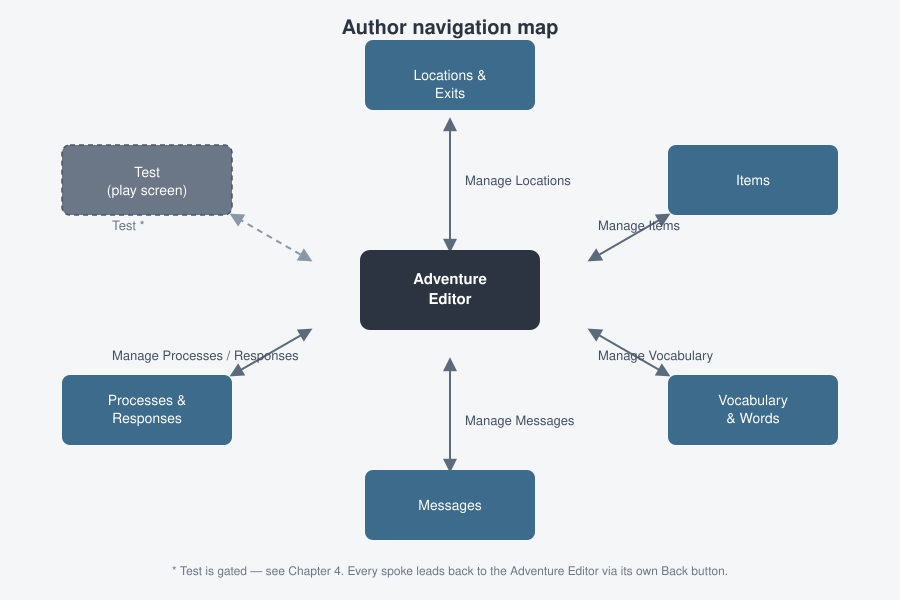

# 4. The Adventure Editor

This is mission control for one adventure — the screen you land on from
**Create Adventure** or from editing an existing one. Every other authoring
screen (locations, items, vocabulary, messages, workflow) is one click away
from here, and every one of those screens brings you back here when you're
done.

When you create a brand-new adventure, the page heading reads **"A new
adventure awaits!"** — Adventure Builder also quietly creates your player's
starting pocket for you (an empty container ready to hold whatever you let
players carry).

## The fields

| Field | What it's for |
|-------|----------------|
| **Adventure ID** | Read-only. Assigned automatically. |
| **Title** | Required — you can't save without one. |
| **Start Location** | Read-only summary of your adventure's starting room. Set indirectly — see [Chapter 5](05-locations-and-exits.md#choosing-the-starting-location). |
| **Total Locations** | Read-only count, for orientation. |
| **Total Items** | Read-only count, for orientation. |
| **Notes** | A free-text scratchpad. Nothing reads this at play time — it's purely for you, e.g. jotting down plot ideas or a to-do list while you build. |

## The "Manage" buttons

These are your doors into the rest of the adventure:

| Button | Takes you to |
|--------|----------------|
| **Manage Vocabulary** | [Vocabulary & Words](07-vocabulary-and-words.md) |
| **Manage Messages** | [Messages](10-messages.md) |
| **Manage System Messages** | [Messages → the built-in engine messages](10-messages.md#editing-the-built-in-system-messages) |
| **Manage Locations** | [Locations & Exits](05-locations-and-exits.md) |
| **Manage Items** | [Items](06-items.md) (every item across the whole adventure) |
| **Manage Processes** | [Workflow → Processes](09-workflow.md#processes-run-every-turn) |
| **Manage Responses** | [Workflow → Responses](09-workflow.md#responses-intercept-a-typed-command) |

> **Note:** Clicking any of these silently saves valid changes to the fields
> above first (if your title etc. currently pass validation), so you won't
> lose in-progress edits by jumping to a sub-editor. It only saves what's
> already valid, though — if **Title** is empty, fix that before you rely on
> this.

## Back, Test, and Save

Unlike most editors in this app, the Adventure Editor's button row is just
three buttons — **Back**, **Test**, **Save** — not the usual four-button
Cancel/Reset/Back/Save bar described in later chapters.

- **Back** returns you to [Your Adventures](03-your-adventures.md). No
  confirmation prompt.
- **Save** is disabled until you've typed a **Title**, and persists your
  changes.
- **Test** launches your adventure in a live play session — see
  [Chapter 11](11-testing-and-running.md). It's disabled until:
  1. This is not a brand-new, never-saved adventure,
  2. you have no unsaved changes (its tooltip says *"Save your changes
     before testing."* until then), and
  3. you've created at least one location.

  Once all three hold, the tooltip changes to *"Play through this
  adventure."* and the button lights up.

## What's next

Start with [Chapter 5: Locations & Exits](05-locations-and-exits.md) —
you'll need at least one location before **Test** will even unlock.
