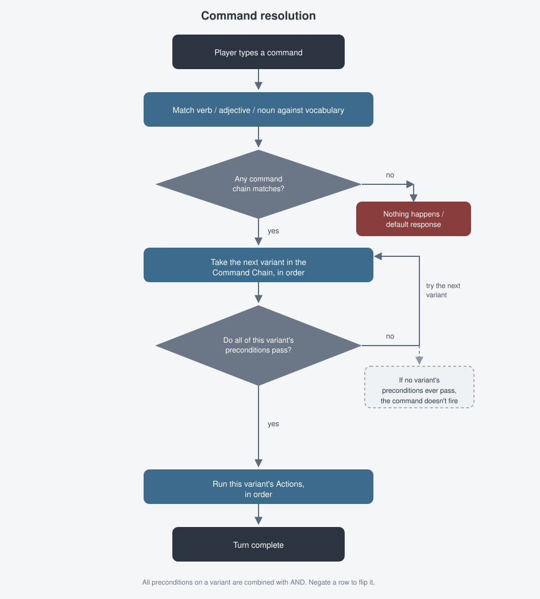

# 8. Commands, Actions & Conditions

This is where gameplay actually happens. A **Command** says: *when the
player types this verb (plus optional adjective/noun), and these
conditions hold, do these things.* Everything from "take the key" to
"say the magic word to open the door" is built here.

## Where commands live

Commands are scoped to wherever you opened **Manage Commands** from — a
location, or an item. This screen shows a read-only grid: **Verb**,
**Adjective**, **Noun**, **Preconditions**, and **Actions**, summarizing
every command in that scope, alongside **Create**, **Back**, **Reset**, and
**Save** buttons.

- **Create** opens a blank command editor.
- **Double-click a row**, or right-click it for **Edit**, to open the full
  editor for that command.
- Right-click a row for **Delete** to remove just that one variant (with no
  separate confirmation step — see the note on deleting below).

## The command editor

### Verb / Adjective / Noun

Three pickers at the top, drawn only from words already in your
[vocabulary](07-vocabulary-and-words.md) — you can't type a new word here.
**Verb** is required; **Adjective** and **Noun** are optional, letting you
build commands as specific as `unlock rusty door` or as general as `look`.

### The Command Chain

Here's the part that surprises new authors: a location or item can have
**more than one command with the exact same verb/adjective/noun**. The
Command Chain grid lists every variant sharing that trigger (its columns
show each one's first precondition and first action, so you can tell them
apart at a glance).

At play time, Adventure Builder walks the chain **in order** and runs the
**first variant whose preconditions all pass**. This is how you make one
verb behave differently depending on game state — e.g. `open door` can have
one variant for "door is locked" (with a `Carried: key` precondition and a
message explaining you need it) and another, later variant with no
precondition at all that actually opens it.

**To add a new variant to an existing chain**, click **Create** from the
commands list and give the new command the *same* Verb/Adjective/Noun as
the chain you want to extend, then **Save** — it's appended to that chain
rather than replacing it. **To remove one variant**, right-click its row in
the Command Chain grid (inside the editor) and choose **Delete**.

> **Note:** You've already met the Command Chain pattern without knowing
> it, if you've checked **Can be picked up** on an item — see
> [Chapter 6](06-items.md#checking-can-be-picked-up). That checkbox
> generates a small chain automatically: a variant that fires when you
> already have the item, one for when it's not actually here, and a
> variant that succeeds — a real, working example of exactly this pattern.

### Preconditions

An ordered list of checks — see the
[Action & Condition reference](appendix-a-action-and-condition-reference.md)
for the full set (Carried, Here, Worn, Player At, Item At, Equals, Greater
Than, Lower Than, Same, Chance). Add one via the **Add Condition** dropdown.
Each row:

- Expands (**Details**) to show/edit its fields.
- Has **Up** / **Down** buttons to reorder it, and **Remove** to delete it.
- Has a **Negate** checkbox — check it to flip the condition, so the
  precondition passes when the check would normally *fail*. This is how you
  express "NOT" — there's no separate "Not" entry in the dropdown; every
  condition can be negated in place instead.

All the preconditions on one command variant are combined with **AND** —
every one of them must pass. There's no OR; if you need "either of these
two things," build it as two separate command-chain variants instead, each
with one of the conditions.

### Actions

A second ordered list, added via the **Select Action Type** dropdown — see
the [Action & Condition reference](appendix-a-action-and-condition-reference.md)
for the full set (Message, Move Player, Move Item, Take, Drop, Wear,
Remove, Destroy, Create Item, Describe, Inventory, Quit, Increment/Decrement/Set
Variable). Same **Up**/**Down**/**Remove** controls as preconditions. All
actions in the list run in order — this is how one command can both print a
message *and* move the player *and* update a variable in a single turn.

## Deleting things a command depends on

Covered in the earlier chapters — Adventure Builder refuses to delete a
location, item, or vocabulary word that a command still references, listing
what's using it. Deleting the *command itself* (via the commands list's
right-click **Delete**), by contrast, happens immediately with no
confirmation — be sure before you use it.

## What's next

Commands you build in a location only fire while the player is in that
location. For rules that should apply *everywhere, every turn* — like a
health check or an ambient event — see
[Chapter 9: Workflow](09-workflow.md).
