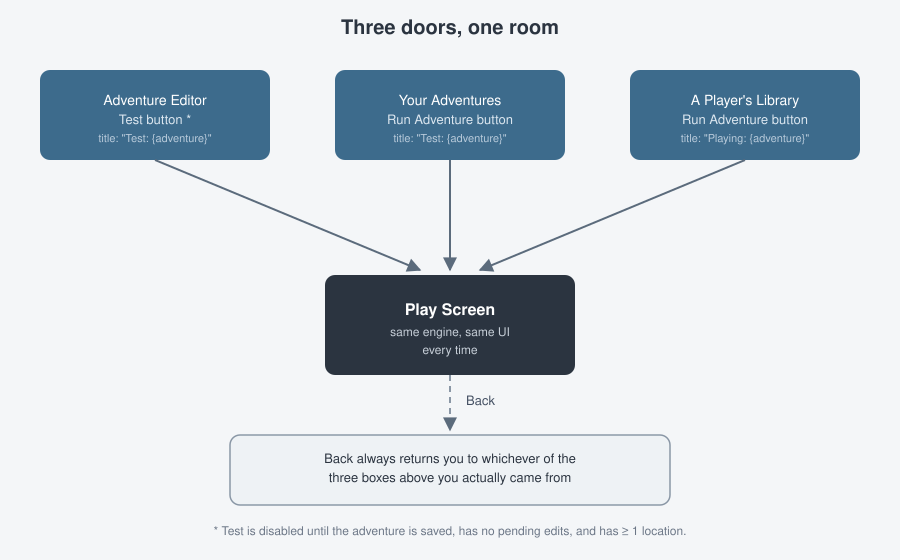

# 11. Testing & Running your adventure

Everything you've built comes together here: a live, playable session of
your adventure, right in the browser.

## Three doors, one room

You can reach the exact same play screen three different ways, and which
one you use only changes where **Back** takes you afterward and whether the
page title says "Test" or "Playing":

| You click… | From… | Back returns you to… | Page title |
|------------|-------|------------------------|------------|
| **Test** | The [Adventure Editor](04-the-adventure-editor.md) | The Adventure Editor | *"Test: {your title}"* |
| **Run Adventure** | [Your Adventures](03-your-adventures.md) | Your Adventures | *"Test: {your title}"* |
| **Run Adventure** | A Player's library (any role assigned as a player, including yours) | The Player's library | *"Playing: {your title}"* |

There is no functional difference between "testing" and "running" — it's
the identical engine, identical screen. "Test" is just the shortcut you
reach for while you're mid-edit; "Run Adventure" is the same thing from
your adventure list, or how a Player experiences your finished work.



## Before Test unlocks

Recapping from [Chapter 4](04-the-adventure-editor.md): **Test** stays
disabled until your adventure is saved, has no pending unsaved edits, and
has at least one location. If it's greyed out, its tooltip tells you why.

**Run Adventure** on Your Adventures / a Player's library has a simpler
gate: just select a row first.

## The play screen

A scrolling transcript above a single text input. The moment the screen
opens, it automatically runs `look` for you, so the first thing you see is
your starting location's description, spoken by **Narrator**. From then on,
whatever you type is echoed into the transcript under your own username,
and the game's response appears as the next Narrator line.

**Back**, above the transcript, exits the session — see the table above for
where it sends you.

## What you can type

Regardless of what you've configured in your
[vocabulary](07-vocabulary-and-words.md#special-words), a handful of core
verbs always work in this screen:

| You type | Does |
|----------|------|
| `look`, `l`, `desc`, `examine`, `x` | Re-describes your current location. |
| `inventory`, `i` | Lists what you're carrying. |
| `help` | Prints a short reminder of what you can do. |
| `quit`, `exit`, `bye` | Ends the session — see below. |

Beyond those, everything is driven by what you've actually built: `take`,
`drop`, `wear`, and `remove` only work on items you've marked
containable/wearable, and any custom verbs only work where you've built
[commands](08-commands-actions-and-conditions.md) or
[exits](05-locations-and-exits.md#exits) for them.

### Chaining commands, and "it"

You can string several commands into one line with **`and`**, **`then`**, or
a full stop:

```
take lamp and light it. go north
```

Each piece runs in order. If one of them fails or isn't understood, the rest
of the line is abandoned. A piece with no verb of its own borrows the verb
from the piece before it (`take lamp and sword`), and **`it`** refers to the
last thing you mentioned (`examine key. take it`). These work in every play
session regardless of your vocabulary setup — `and`, `then` and `it` are
always understood.

> **Note:** `save` and `load` are **not** available inside a test/run
> session. A session here is scoped to one adventure, played start to
> finish in one sitting — it's meant for trying things out and giving
> Players a straightforward play experience, not for a long-running,
> resumable game.

## Quitting

Typing `quit` (or `exit`/`bye`) ends the session — you'll see a farewell
line and the text input disables itself. It does **not** automatically
navigate you anywhere; click **Back** when you're ready to leave.

## What's next

[Chapter 12](12-tips-and-current-limits.md) rounds up honest notes on
what's still rough — worth a skim before you build something around a
screen that isn't quite finished yet.
